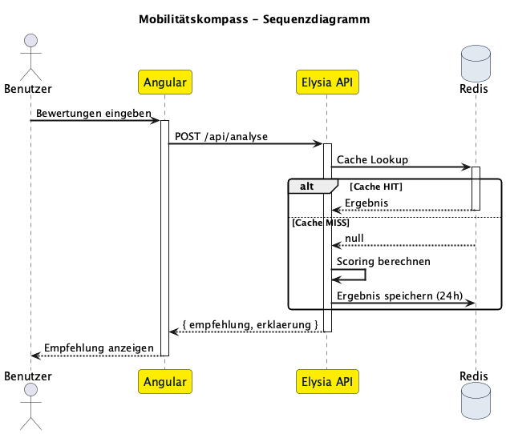

# 🧭 Mobilitätskompass

> **Intelligentes Mobilitäts-Empfehlungssystem** – Entwickelt im Rahmen des HUK-COBURG Hackathon 2026

Der Mobilitätskompass analysiert die persönlichen Präferenzen eines Nutzers und empfiehlt die optimale Fortbewegungsart für den individuellen Alltag. Über einen interaktiven Fragebogen werden Prioritäten wie Budget, Komfort, Nachhaltigkeit und Flexibilität erfasst – das System liefert daraufhin eine personalisierte Empfehlung mit ausführlicher Begründung.

---

## 📋 Inhaltsverzeichnis

- [Hintergrund](#-hintergrund)
- [Funktionsweise](#-funktionsweise)
- [Architektur](#-architektur)
- [Tech-Stack](#-tech-stack)
- [Projektstruktur](#-projektstruktur)
- [Installation & Entwicklung](#-installation--entwicklung)
- [Docker](#-docker)
- [API-Dokumentation](#-api-dokumentation)
- [Scoring-Algorithmus](#-scoring-algorithmus)

---

## 🎯 Hintergrund

Die steigende Vielfalt an Mobilitätsangeboten – vom klassischen Auto über ÖPNV und Fahrradleasing bis hin zu E-Scootern, Carsharing und Ride-Hailing – stellt viele Menschen vor die Frage: **Welches Verkehrsmittel passt eigentlich am besten zu mir?**

Der Mobilitätskompass beantwortet diese Frage datenbasiert und individuell. Statt pauschaler Empfehlungen berücksichtigt das System sechs persönliche Kriterien sowie die tatsächliche ÖPNV-Anbindung am Wohnort des Nutzers.

---

## ⚙️ Funktionsweise

### Interaktiver Fragebogen (7 Schritte)

Der Nutzer durchläuft einen Schritt-für-Schritt-Wizard mit folgenden Kriterien:

| Schritt | Kriterium | Skala |
|---------|-----------|-------|
| 1 | **Budget** – Wie wichtig ist ein niedriger Preis? | 1 (egal) → 5 (sehr preisbewusst) |
| 2 | **Komfort** – Wie wichtig ist Bequemlichkeit? | 1 (spartanisch) → 5 (maximaler Komfort) |
| 3 | **Nachhaltigkeit** – Wie wichtig ist Umweltfreundlichkeit? | 1 (nebensächlich) → 5 (höchste Priorität) |
| 4 | **Distanz** – Wie weit ist der typische Weg? | 1 (sehr kurz) → 5 (sehr weit) |
| 5 | **ÖPNV-Anbindung** – Wie gut ist die Anbindung? | 1 (keine) → 5 (hervorragend) |
| 6 | **Flexibilität** – Wie wichtig ist Unabhängigkeit? | 1 (feste Zeiten ok) → 5 (volle Flexibilität) |
| 7 | **Führerschein** – Ist ein Führerschein vorhanden? | Ja / Nein |

### Smarte Adress-Erkennung

Bei der Eingabe der ÖPNV-Anbindung kann der Nutzer optional seine Adresse eingeben. Das System nutzt dann:

- **Nominatim** (OpenStreetMap) zur Geokodierung der Adresse
- **Overpass API** zur Ermittlung von Bus-, Bahn- und Tramhaltestellen im Umkreis von 1 km
- Automatische Bewertung der Anbindung anhand der Haltestellenanzahl (0 = schlecht, 10+ = hervorragend)

### Sechs Mobilitätskategorien

| Kategorie | Beschreibung |
|-----------|-------------|
| 🚗 **Auto** | Maximaler Komfort & Unabhängigkeit, ideal für weite Strecken |
| 🚌 **ÖPNV** | Budgetfreundlich & nachhaltig, setzt gute Anbindung voraus |
| 🚲 **Fahrrad** | Günstigste & nachhaltigste Option, ideal für kurze Distanzen |
| 🛴 **E-Scooter** | Moderner urbaner Transport, flexibel in der Stadt |
| 🚙 **Carsharing** | Autonutzung ohne Besitz, erfordert Führerschein |
| 📱 **Uber** | Tür-zu-Tür-Komfort ohne eigenes Fahrzeug |

### Personalisiertes Ergebnis

Nach der Analyse erhält der Nutzer:
- Die **optimale Mobilitätsempfehlung** mit Icon und Titel
- Eine **individuelle Begründung**, warum genau diese Option passt
- **Relevante Links** zu Drittanbieter-Services (Versicherungen, Kaufoptionen, Mobilitätsdienste)
- Die Möglichkeit, eine **neue Analyse** zu starten

---

## 🏗️ Architektur



### Ablauf

```
Angular Client (Port 4200)
        │
        ▼  POST /api/analyse
Elysia REST API (Bun, Port 3000)
        │
        ▼  Cache-Check
Redis Cache (Port 6379)
        │
    ┌───┴───┐
    HIT    MISS
    │       │
    │    Scoring-Engine
    │    berechnet gewichtete
    │    Scores für alle 6 Optionen
    │       │
    │    Ergebnis in Redis
    │    speichern (TTL: 24h)
    │       │
    └───┬───┘
        │
        ▼  JSON Response
Angular Client
{ empfehlung, erklaerung }
```

**Graceful Degradation:** Ist Redis nicht verfügbar, berechnet die API das Ergebnis trotzdem – ohne Caching, aber ohne Fehler für den Nutzer.

---

## 🛠️ Tech-Stack

| Komponente | Technologie | Version |
|------------|-------------|---------|
| **Backend** | Elysia (Bun) | – |
| **Frontend** | Angular (Standalone Components) | 21.x |
| **Caching** | Redis | 7 (Alpine) |
| **Monorepo** | Turborepo | 2.8.x |
| **Sprache** | TypeScript | 5.9.x |
| **Paketmanager** | Bun | 1.3.9 |
| **Containerisierung** | Docker & Docker Compose | – |
| **Node.js** | ≥ 18 erforderlich | – |

---

## 📁 Projektstruktur

```
├── apps/
│   ├── app/                          # Elysia REST API (Bun)
│   │   └── src/
│   │       ├── index.ts              # Server & Endpunkt-Definition
│   │       ├── service.ts            # Scoring-Engine (6 Algorithmen)
│   │       ├── model.ts              # TypeScript-Typen & Validierung
│   │       └── cache.ts              # Redis-Client & Cache-Logik
│   │
│   └── web/                          # Next.js Wrapper + Angular App
│       └── app/
│           └── mobility-ang/         # Angular Frontend
│               └── src/app/
│                   ├── components/    # Wiederverwendbare Komponenten
│                   │   ├── compass/  # Interaktiver SVG-Kompass
│                   │   ├── navbar/   # Navigation mit Mobile-Menü
│                   │   └── footer/   # Footer mit Kategorie-Links
│                   ├── features/     # Seiten-Module
│                   │   ├── home/     # Startseite mit Kompass
│                   │   ├── analyse/  # Fragebogen-Wizard & Ergebnisse
│                   │   ├── auto/     # Kategorie-Detailseiten
│                   │   ├── oepnv/
│                   │   ├── fahrrad/
│                   │   ├── e-scooter/
│                   │   ├── carsharing/
│                   │   └── uber/
│                   ├── models/       # Interfaces & Kategorie-Daten
│                   └── services/     # HTTP-Client für API-Kommunikation
│
├── packages/                         # Geteilte Konfigurationspakete
│   ├── eslint-config/                # ESLint-Regeln
│   ├── typescript-config/            # Geteilte tsconfig.json
│   └── ui/                           # Shared UI-Komponenten
│
├── docs/                             # Architektur-Dokumentation
│   ├── request-flow.md               # Detaillierter Request-Ablauf
│   ├── request-flow.puml             # PlantUML Sequenzdiagramm
│   ├── request-flow-sequence.png     # Sequenzdiagramm (gerendert)
│   ├── request-flow-architecture.png # Architekturdiagramm (gerendert)
│   └── architecture-flow.puml        # PlantUML Architekturübersicht
│
├── docker-compose-dev.yml            # Docker-Konfiguration
├── Dockerfile.api                    # API-Container (Bun)
├── Dockerfile.web                    # Web-Container (Node 22)
├── turbo.json                        # Turborepo-Konfiguration
└── package.json                      # Root-Konfiguration & Scripts
```

---

## 🚀 Installation & Entwicklung

### Voraussetzungen

- [Bun](https://bun.sh/) ≥ 1.3.9
- [Node.js](https://nodejs.org/) ≥ 18
- [Redis](https://redis.io/) (optional, Fallback ohne Caching)
- [Angular CLI](https://angular.dev/) (für Frontend-Entwicklung)

### Abhängigkeiten installieren

```sh
bun install
```

### Entwicklungsserver starten

**Alle Services gleichzeitig:**

```sh
bun run dev
```

**Nur API (Port 3000):**

```sh
bun run rest
```

**Nur Frontend (Port 4200):**

```sh
bun run website
```

> **Hinweis:** Das Angular-Frontend leitet API-Anfragen über einen Proxy an `http://localhost:3000` weiter. Beide Services sollten daher parallel laufen.

---

## 🐳 Docker

Alle Services können containerisiert gestartet werden:

```sh
bun run docker
```

Dies startet drei Container via Docker Compose:

| Service | Port | Image |
|---------|------|-------|
| **Redis** | 6379 | `redis:7-alpine` |
| **API** | 3000 | Bun-basiert (`Dockerfile.api`) |
| **Web** | 4200 | Node 22 mit Angular CLI (`Dockerfile.web`) |

**Umgebungsvariablen:**

| Variable | Standard | Beschreibung |
|----------|----------|-------------|
| `REDIS_URL` | `redis://localhost:6379` | Redis-Verbindungs-URL |

---

## 📡 API-Dokumentation

### `POST /api/analyse`

Berechnet die optimale Mobilitätsempfehlung basierend auf den Nutzerpräferenzen.

**Request Body:**

```json
{
  "budget": 4,
  "comfort": 2,
  "eco": 5,
  "distance": 1,
  "availability": 4,
  "flexibility": 3,
  "fuehrerschein": true
}
```

Alle Bewertungsfelder müssen zwischen **1 und 5** liegen. `fuehrerschein` ist ein Boolean.

**Response (200):**

```json
{
  "empfehlung": "Fahrrad",
  "erklaerung": "Basierend auf Ihren Angaben empfehlen wir Ihnen das Fahrrad als optimales Verkehrsmittel. ..."
}
```

**Fehler (400):** Ungültige Eingabewerte.

**Caching:** Ergebnisse werden in Redis mit einem TTL von 24 Stunden gespeichert. Der Cache-Schlüssel setzt sich aus allen Eingabeparametern zusammen: `mobility:{budget}:{comfort}:{eco}:{distance}:{availability}:{flexibility}:{fuehrerschein}`

---

## 🧮 Scoring-Algorithmus

Die Scoring-Engine berechnet für jede der sechs Mobilitätsoptionen einen gewichteten Score. Die Option mit dem höchsten Score wird empfohlen.

| Option | Profitiert von | Wird bestraft durch |
|--------|----------------|---------------------|
| **Auto** | Komfort ↑, Distanz ↑, ÖPNV-Anbindung ↓ | Nachhaltigkeit ↑ |
| **ÖPNV** | Budget ↑, Nachhaltigkeit ↑, Anbindung ↑ | Flexibilität ↑ |
| **Fahrrad** | Budget ↑, Nachhaltigkeit ↑, Flexibilität ↑ | Komfort ↑, Distanz ↑ |
| **E-Scooter** | Budget ↑, Flexibilität ↑ | Distanz ↑ |
| **Carsharing** | Komfort ↑, Flexibilität ↑ | Nachhaltigkeit ↑ |
| **Uber** | Komfort ↑, Flexibilität ↑, Distanz ↓ | Budget ↑ |

Optionen, die einen Führerschein erfordern (Auto, Carsharing), werden automatisch ausgeschlossen, wenn `fuehrerschein = false`.

Bei insgesamt **5⁶ × 2 = 31.250 möglichen Kombinationen** sorgt das Redis-Caching für schnelle Antwortzeiten bei wiederholten Anfragen.

---

## 📄 Lizenz

Dieses Projekt wurde im Rahmen des HUK-COBURG Hackathon 2026 entwickelt.
